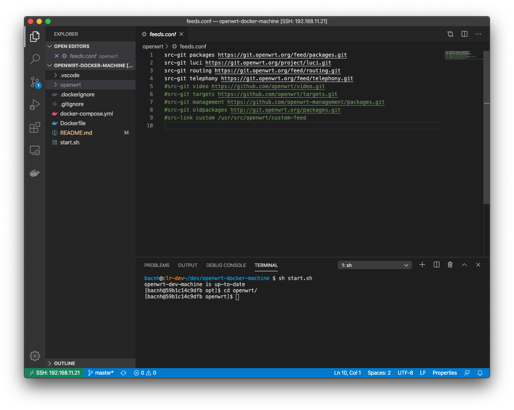

As there are [many reasons to use OpenWrt](https://openwrt.org/reasons_to_use_openwrt), I need to build OpenWrt iamge for my router at home as a part of [my HomeLab project](https://bacnh.com/tag/homelab/).

I prefer [Archlinux](https://wiki.archlinux.org/index.php/Arch_Linux) as a base container image for OpenWrt build:
>Arch Linux is an independently developed, x86-64 general-purpose GNU/Linux distribution that strives to provide the latest stable versions of most software by following a rolling-release model. The default installation is a minimal base system, configured by the user to only add what is purposely required.

This Archlinux container feature:
- Share SSH key with the host
- Share same UID, GID with the host for file editing
- Build environment: Archlinux latest

## Usage

Clone this repo:

```
git clone https://github.com/ngohaibac/openwrt-docker-machine.git
cd openwrt-docker-machine
```

Change UID, GID in Dockerfile to match your user information. You can find UID, GID from your current Linux box with `id` which are 1000, 1000, respectively in my ClearLinux box. By doing this, there is no read/write permission when compiling.

```
$ id
uid=1000(bacnh) gid=1000(bacnh) groups=1000(bacnh),10(wheel),202(docker)
```

Start the bash inside the container to build OpenWrt image:

```bash
sh start.sh 
Creating openwrt-dev-machine ... done
[bacnh@59b1c14c9dfb opt]$ 
```

Then, follow the [OpenWrt guidance](https://github.com/openwrt/openwrt) to get source and compile your image.

```
$ git clone https://github.com/openwrt/openwrt
```

Together with [VSCode + Remote-SSH plugin](https://bacnh.com/how-to-develop-using-vscode-with-your-remote-server-over-ssh/), I am able to build OpenWrt image in my server remotely. 



## Docker-compose usage

docker-compose.yml is provided inside the repo. You can customize to fit your need of bind mount.

```
version: '2'
services:
  openwrt_dev_machine:
    image: ngohaibac/openwrt_dev_machine
    container_name: openwrt-dev-machine
    volumes:
      - "./:/opt/"
      - ~/.ssh:/home/tux/.ssh
    tty: true
    network_mode: bridge
```

## Contribute

Welcome anyone to raise PR to my github repo: https://github.com/ngohaibac/openwrt-docker-machine